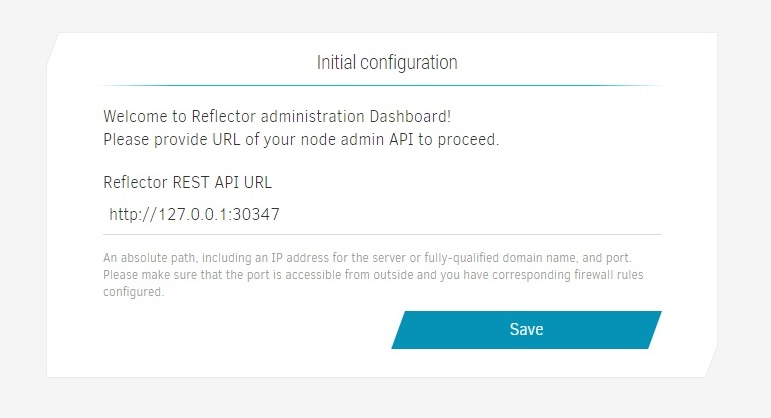
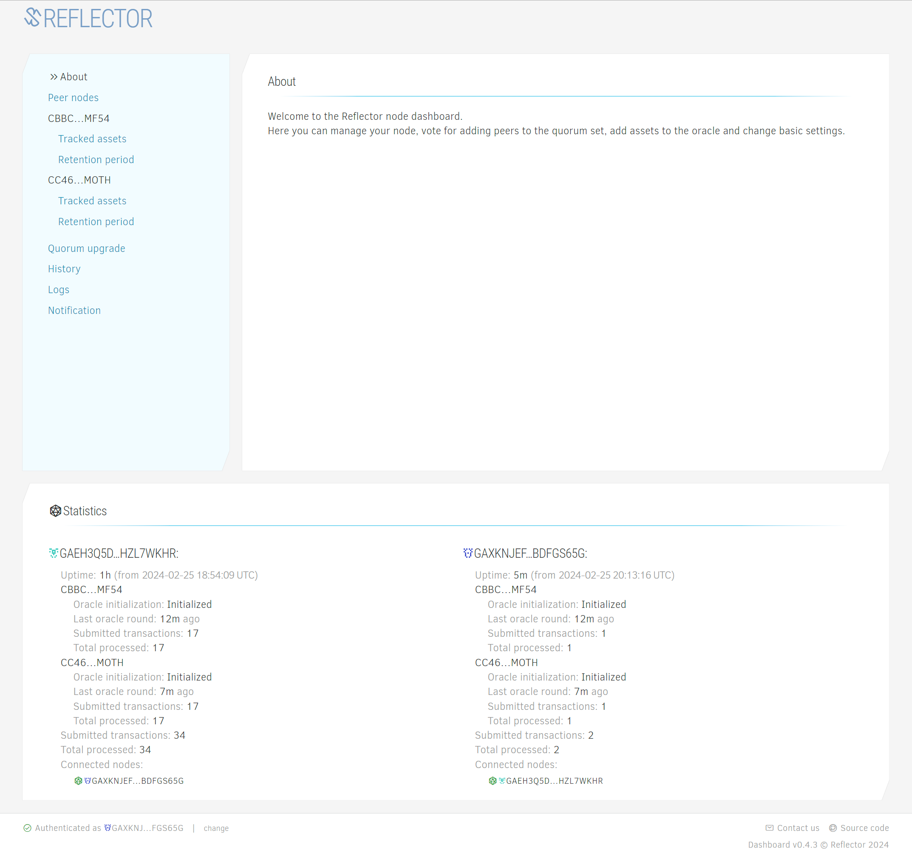
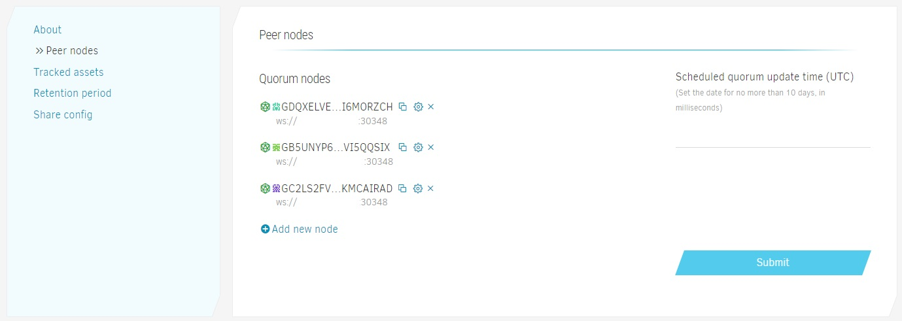
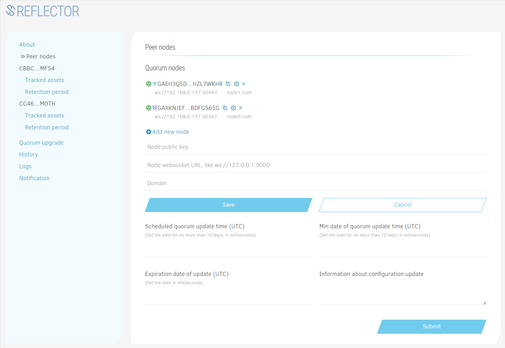
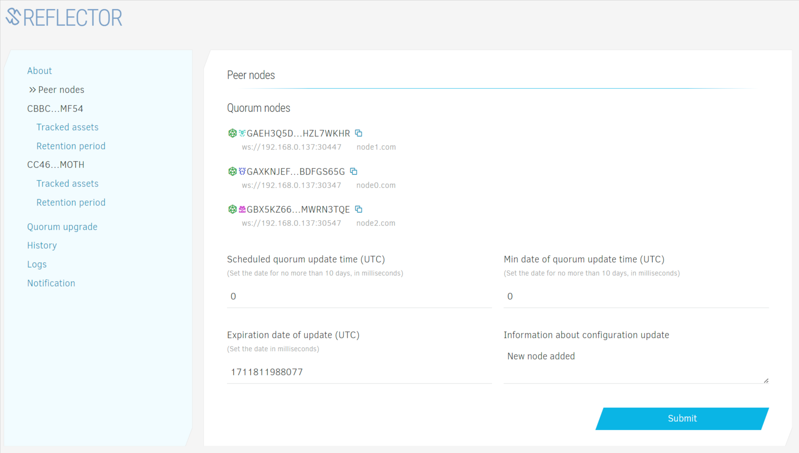
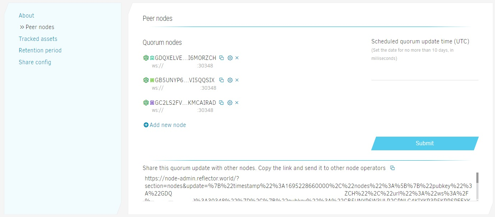
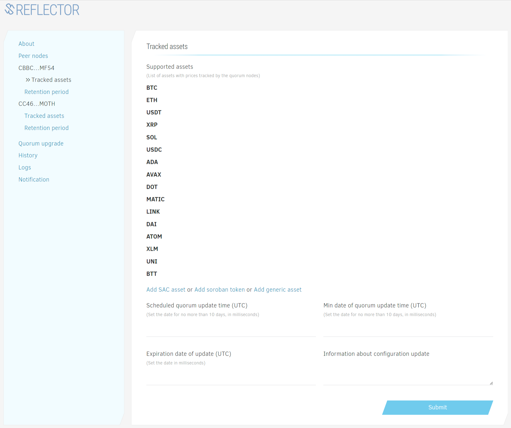
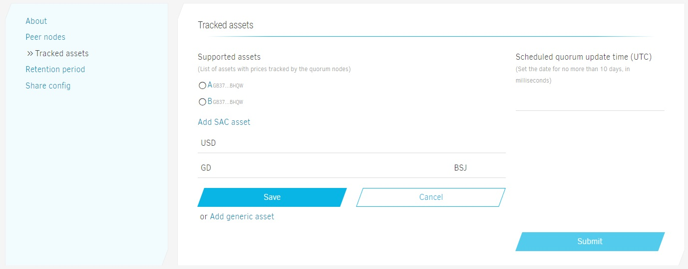
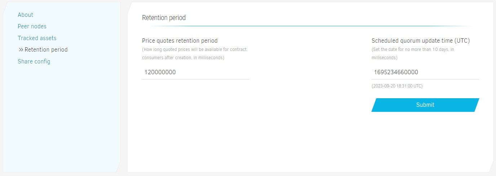
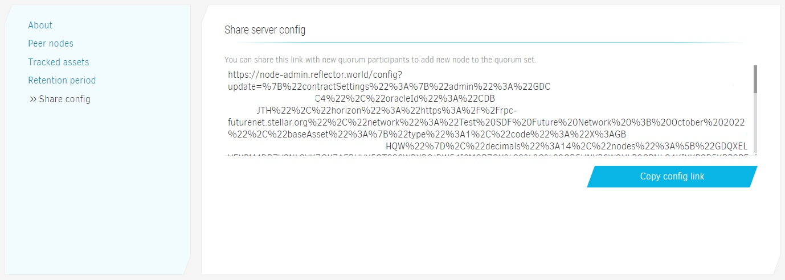

# Reflector Node Admin Guide

## Installation

1. [Install Docker](https://docs.docker.com/engine/install/).
2. Create a directory for Reflector node server. Configuration files and logs will be stored there.
3. If you plan to run a new instance of Stellar Core sever, create a home directory for StellarCore database and server files.
4. Generate ED25519 keypair for the node (you can use [Stellar Laboratory](https://laboratory.stellar.org/#account-creator?network=public) or any other keypair generator).
5. Start Reflector Docker image 

Running Reflector with built-in StellarCore image:
```bash
docker run -d -p 30347:30347 -p 30348:30348 -e SECRET=S...X -e NODE_ENV=development -v "/opt/reflector-node-home:/reflector-node/app/home" -v "/opt/stellar-data:/opt/stellar" --name=reflector reflectornet/reflector-node-stellar-core:v0.1.0 --futurenet --enable-soroban-rpc
```

Running Reflector standalone (requires connection to the database of StellarCore instance with Futurenet):
```bash
docker run -d -p 30347:30347 -p 30348:30348 -e SECRET=S...Y -e NODE_ENV=development -v "/opt/reflector-node-home:/reflector-node/app/home" --name=reflector reflectornet/reflector-node-standalone:v0.1.0
```

Do not forget to open corresponding firewall ports and provide `SECRET` variable.

It can take some time to sync Stellar database. You can expose Horizon port as well by providing `-p 8000:8000` argument to the `docker run` command.

## Joining Reflector nodes cluster

1. Navigate to [Reflector Node admin dashboard](https://node-admin.reflector.world) in a browser 
2. Provide node API URL, e.g. `http://210.101.14.05:30347`
     
3. Authorize via [Albedo](https://albedo.link). Click the Authorize button, and follow instructions. 
   Please make sure to use the same keypair you generated during the installation. 
4. Request the configuration link from one of the current members of Reflector cluster. Open the link in the browser after you receive it.
5. You should see the "Initial node configuration" page:
     
   **_Note:_** With `reflector-node-standalone` you'll need to provide the database connection string of a running StellarCore instance.  
   Submit the config. You will be asked to authorize the request.
6. After successful node initialization, you will be redirected to the dashboard home screen.
     
7. The node is ready!

## Updating cluster settings

### Adding new node

> When a new node joins the cluster, every other Reflector node need to confirm this action.

1. Navigate to "Peer Nodes" section.
     
2. Click "Add new node" and set new node public key and websocket connection URL (provided by the node operator).
     
3. Schedule the update by setting the timestamp.
   
   **_Note:_** Minimum allowed timestamp is the current UTC date plus 30 minutes, maximum is current date plus 10 days.
   The timestamp will be normalized to avoid concurrency conflicts with price updates.
4. Confirm the action. You will see the update link. Copy it and share with other cluster nodes to coordinate the quorum update.
   

### Adding new asset

1. Navigate to "Tracked assets" section.
     
2. Choose "Add SAC asset" for adding Stellar Classic asset or "Add generic asset" for adding any external symbol to tracked assets.
3. Set asset **code** and **issuer** for SAC asset.  
     
4. Schedule the update by setting the timestamp.  
   **_Note:_** Minimum allowed timestamp is the current UTC date plus 30 minutes, maximum is current date plus 10 days.
   The timestamp will be normalized to avoid concurrency conflicts with price updates.
5. Confirm the action. You will see the update link. Copy it and share with other cluster nodes to coordinate the quorum update.
   

### Updating history retention period

1. Navigate to "Retention period" section.
2. Set history retention period in milliseconds and timestamp. That's the period during which price records will be retained on the ledger.
     
3. Schedule the update by setting the timestamp.  
   **_Note:_** Minimum allowed timestamp is the current UTC date plus 30 minutes, maximum is current date plus 10 days.
   The timestamp will be normalized to avoid concurrency conflicts with price updates.
4. Confirm the action. You will see the update link. Copy it and share with other cluster nodes to coordinate the quorum update.
   


### Sharing current node config

> Sharing node config is the easiest way to invite new node to the quorum. Please do not share these links publicly to avoid possible DDoS exposure.

1. Navigate to `Share config`
     
2. Copy config, and share it with the node operator you want to invite to the quorum set.  
   **_Note:_** If you're sharing the config with a new node, you need to wait for the pending nodes update to complete to avoid collisions.