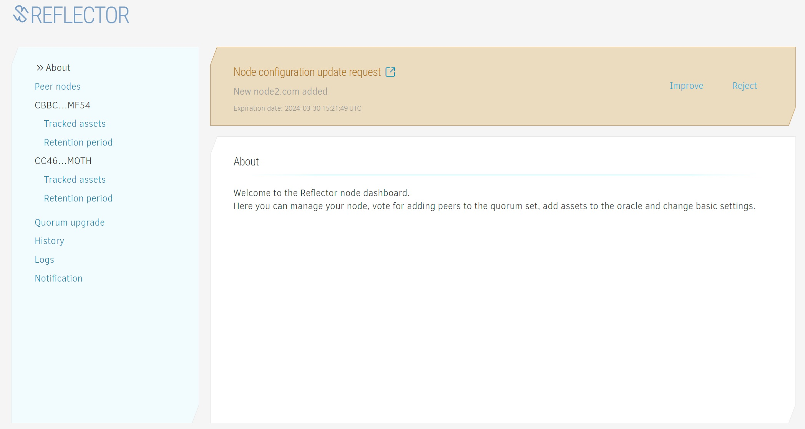
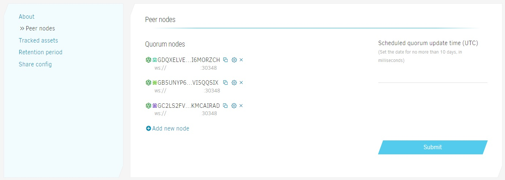
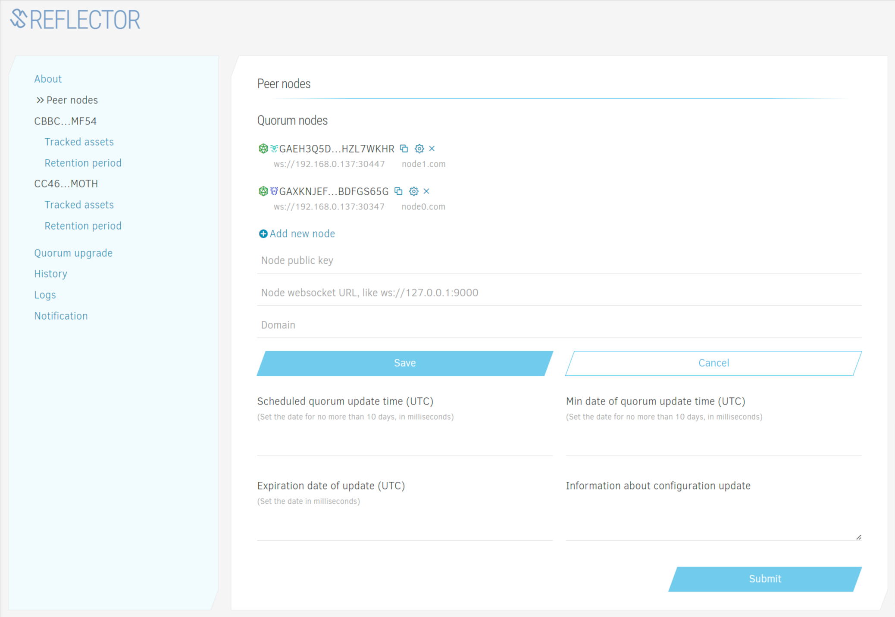
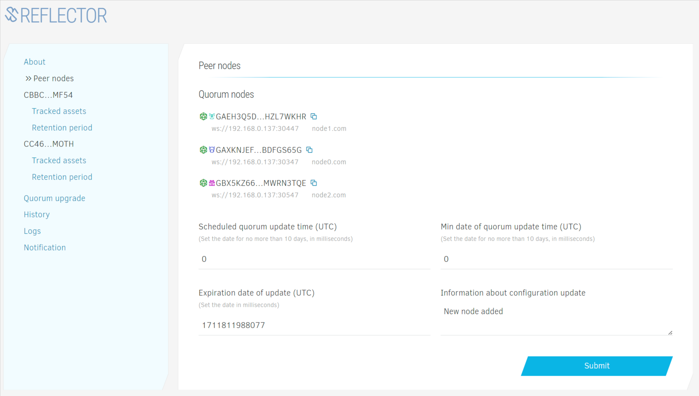
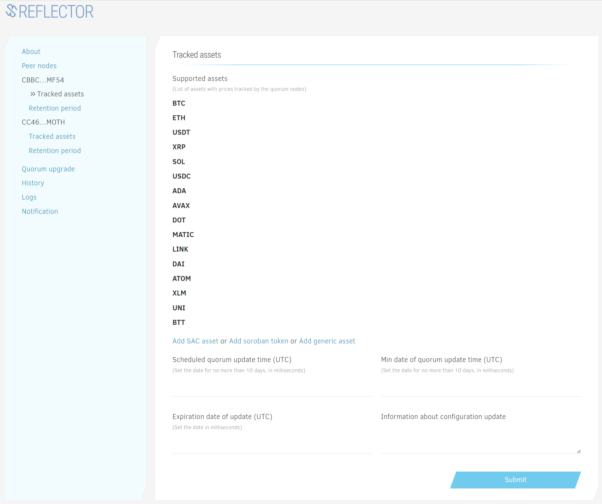
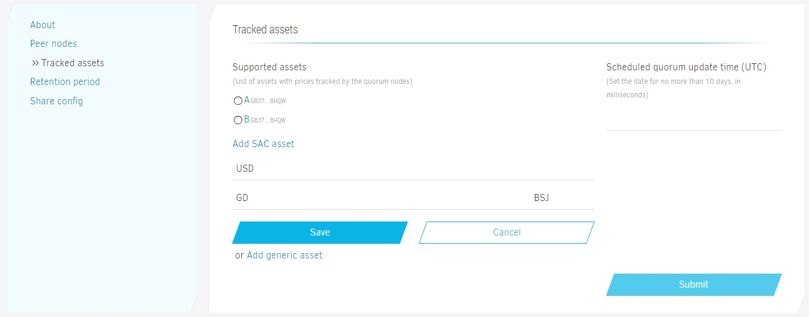
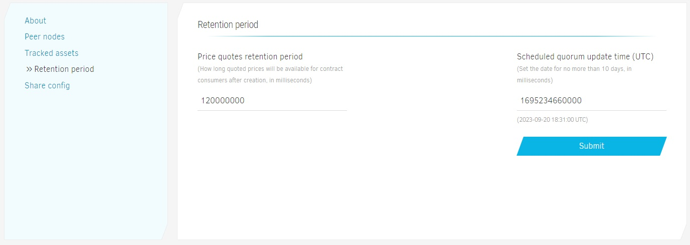

# Reflector Node Admin Guide

## Installation

1. [Install Docker](https://docs.docker.com/engine/install/).
2. Create a home directory for the Reflector node server. Configuration files and logs will be stored there.
3. Generate ED25519 keypair for the node (you can use [Stellar Laboratory](https://lab.stellar.org/account/create) or any other keypair generator).
4. In the home directory, create the `app.config.json` file. 
```json
{
  "secret": "SA5G...1DKG",
  "dataSources": {
    "pubnet": {
      "sorobanRpc": ["https://soroban-testnet.stellar.org"],
      "type": "db",
      "name": "pubnet"
    }
  }
}
```
5. In order to function properly, a Reflector node needs a reliable RPC server (preferably, self-hosted) that supports 
  `getEvents`, `getTransaction`, `getTrasnactions`, `getLatestLedger`, `getLedgerEntries`, `sendTransaction`,
  `simulateTransaction` methods. Some RPC infrastructure providers restrict access to some of these methods,
  particularly `getTrasnactions`. Additional fault-tolerance increase can be achieved by specifying more than one RPC
  server in the config, but it's optional.
6. Open a corresponding incoming/outgoing TCP port in the firewall (`30347` by default).
7. Start the Reflector Docker image. By default, it listens on the `30347` port.
  For example, with a default port and a `/opt/reflector-node-home` home directory, the command should look like this:  
```bash
docker run -d --network host -p 30347:30347 -v "/opt/reflector-node-home:/reflector-node/app/home" --name=reflector reflectornet/reflector-node:latest
```
ⓘ If you run a new instance of Stellar RPC, it can take some time to sync with the netowrk.

## Configuring gateways

Gateways are lightweight proxy servers utilized by Reflector nodes to fetch the data from exchanges
(provides increased bandwidth and helps to deal with IP rate limitations) and send out all subscription notifications
while protecting the node infrastructure from potential external attacks.

Every node must have at least 3 active gateways before updating the node software itself.

1. Visit https://node-admin.reflector.network/gateway-initial-config
2. Click "Add gateway" and copy the autogenerated cloud-init script.
3. Deploy a gateway server (VPS or cloud instance) using the cloud-init script (if you are not going to use cloud-init,
  please use the settings from the script). There are no specific requirements for the hardware.
  A gateway server must have at least 1GB of RAM and a dedicated public IP. Any basic image with UFW and Docker should
  be sufficient. Gateways must have different public IPs, so launching all 3 gateways on the same physical machine
  won't work. Please do not deploy gateways in the United States or sanctioned jurisdictions because many crypto
  platforms block incoming API requests from such countries.
4. Copy-paste an IP address and port of the newly launched gateway server to the form with the setup script at the 
  initial gateway config page and press "Add".
5. Repeat steps 2-4 two more times to expand the fleet to at least 3 gateways.
6. Click a "Download" link below the gateways list and save the autogenerated `gateways.json` file in the Reflector node
  home directory (the same directory that contains node config file).

ⓘ Please note: do not leave or refresh the initial gateway config page until you finish the setup of all gateways and
download the config, as it might generate a new secret, not compatible with the gateways that you already deployed.

## Joining Reflector cluster

1. Navigate to [Reflector Node admin dashboard](https://node-admin.reflector.network) in a browser 
2. Authorize via [Albedo](https://albedo.link). Click the Authorize button, and follow instructions. 
   Please make sure to use the same keypair you generated during the installation. 
3. After the authorization you need to sign the config to sync it with the quorum. 
     
4. Your node should be up and running now.

### How a node decides to trust its very first cluster config

A node that has never adopted a cluster config has nothing of its own to check an incoming one against, so it will not
take the orchestrator's word for it. It adopts its first config only when one of the following holds.

- **The config carries your own signature.** This is what step 3 above produces, and it is the normal route: as soon as
  you sign the live cluster config in the dashboard, the orchestrator pushes the config back to every node, your
  signature is in it, and your node adopts it. Nothing else is needed.
- **The config hash matches `clusterConfigHash` in `app.config.json`.** Use this when you want the node to come up
  before you sign, or when you prefer to pin the exact config the node may join:
  ```json
  {
    "secret": "SA5G...1DKG",
    "clusterConfigHash": "9f2c…64 hex characters…1ab7",
    "dataSources": { "...": {} }
  }
  ```
  The hash is the `hash` field of `currentConfig` returned by the orchestrator's `GET /config` endpoint when called
  with an authenticated node key, and it is also printed by the node itself (see below). `clusterConfigHash` is
  optional; it is consulted only while the node holds no cluster config, and is ignored from then on. A malformed value
  stops the node at startup with a config issue.
- **You placed `.config.json` in the home directory yourself.** The node loads and adopts it at startup with no network
  involvement at all. If that file is present but fails validation the node stops with an error instead of
  continuing as if it were a fresh install.

When none of these holds, the node logs an error naming both remedies together with the hash it received, for example:

```
Refusing the first cluster config: it carries no accepting signature from this node and its hash is not the
clusterConfigHash configured in app.config.json ... receivedHash=9f2c...1ab7 configuredHash=null
```

Confirm that hash out of band — against `GET /config`, or with another operator — before copying it into
`app.config.json`. It arrived over the same channel the check exists to constrain, so it is a convenience for finding
the right value, not evidence that the value is right.

This only ever affects a node with no config loaded. Once a node holds a cluster config, updates are adopted exactly as
before: a majority of the *current* node set must have signed the new config, your own vote is not required, and a
config whose signatures all predate the one the node already holds is refused as a rollback.

## Updating cluster settings

### Adding new node

> When a new node joins the cluster, every other Reflector node need to confirm this action.

1. Navigate to the "Peer Nodes" section.
     
2. Click "Add new node" and set new node public key, websocket connection URL (provided by the node operator) and the node operator domain.
     
3. Schedule the update by setting the timestamp.
   
4. Confirm the action. Notify other quorum node operators about the update and ask them to confirm it.
5. After the update concludes, the new node will be added to the quorum set.

### Adding new asset

1. Navigate to the "Tracked assets" section.
     
2. Choose "Add SAC asset" for adding a Stellar Classic asset, "Add generic asset" for adding any external symbol, or "Add soroban token" for adding a smart contract-based token.
   
3. Set asset **code** and **issuer** for SAC asset.  
     
4. Schedule the update by setting the timestamp.
5. Confirm the action. Notify other cluster node operators about the update and ask them to confirm it.

### Updating history retention period

1. Navigate to "Retention period" section.
2. Set history retention period in milliseconds and timestamp. That's the period during which price records will be retained on the ledger.
     
3. Schedule the update by setting the timestamp.
4. Confirm the action. Notify other cluster node operators about the update and ask them to confirm it.

**_Note:_** Minimum allowed "timestamp" is the current UTC date plus 30 minutes, maximum is current date plus 10 days.
The value will be automatically normalized to avoid concurrency conflicts with price updates.
If you want to add a new node as soon as possible, you can set the timestamp to 0. 
After the majority of nodes confirm the update, the timestamp will be set to the current time + 10 minutes.
