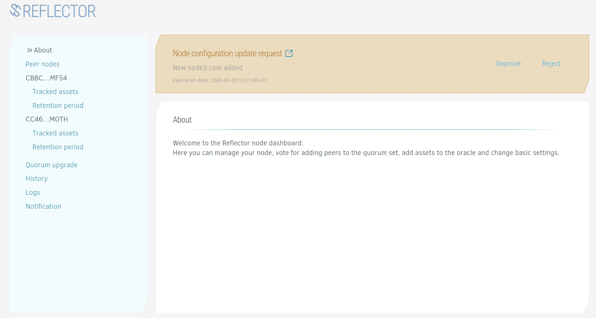
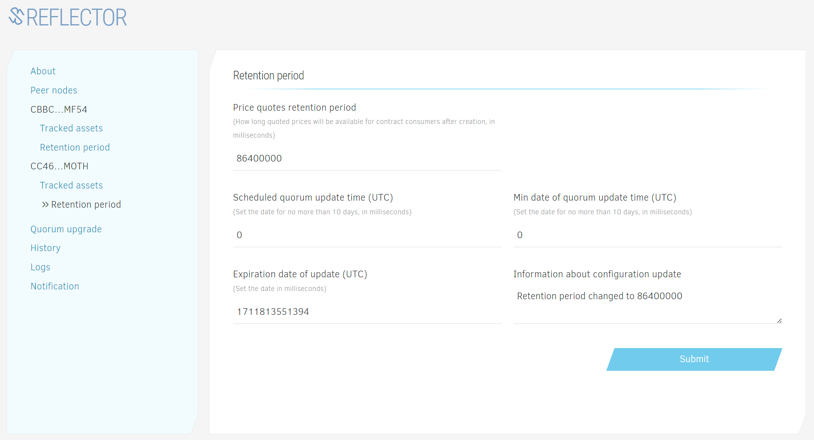

# Reflector Node Admin Guide

## Installation

1. [Install Docker](https://docs.docker.com/engine/install/).
2. Create a directory for Reflector node server. Configuration files and logs will be stored there.
3. Put the app.config.json file in the directory. 
```json
{
  "secret": "S...G", //secret key of the node
  "dataSources": { //data sources for price data
    "coinmarketcap": {
      "type": "api",
      "secret": "COINMARKETCAP_API_KEY",
      "name": "coinmarketcap"
    },
    "pubnet": {
      "dbConnection": "postgres://stellar:@187.241.174.205:5432/stellar-core",
      "horizonUrl": "https://soroban-testnet.stellar.org",
      "type": "db",
      "name": "testnet"
    }
  },
  "dbSyncDelay": 15, //delay in seconds for database synchronization. Optional, default is 15
  "orchestratorUrl": "http://182.168.11.137:12274" //orchestrator URL. Optional, default is "https://orchestrator.reflector.world"
}
```
4. If you plan to run a new instance of Stellar Core sever, create a home directory for StellarCore database and server files. And start Stellar Core Docker image. 
```bash
docker run -it -d -e POSTGRES_PASSWORD=123456 -p 5432:5432 -v "STELLAR_WORKDIR:/opt/stellar" --name stellar stellar/quickstart:soroban-dev --testnet
```
5. Generate ED25519 keypair for the node (you can use [Stellar Laboratory](https://laboratory.stellar.org/#account-creator?network=public) or any other keypair generator).
6. Start Reflector Docker image 
```bash
docker run -d -p 30347:30347-e NODE_ENV=development -v "/opt/reflector-node-home:/reflector-node/app/home" --name=reflector reflectornet/reflector-node:latest
```

Do not forget to open corresponding firewall port.

It can take some time to sync Stellar database. You can expose Horizon port as well by providing `-p 8000:8000` argument to the `docker run` command.

## Joining Reflector nodes cluster

1. Navigate to [Reflector Node admin dashboard](https://node-admin.reflector.world) in a browser 
2. Authorize via [Albedo](https://albedo.link). Click the Authorize button, and follow instructions. 
   Please make sure to use the same keypair you generated during the installation. 
3. After login, you need to sign the config to sync it with the node. 
     
4. The node is ready!

## Updating cluster settings

### Adding new node

> When a new node joins the cluster, every other Reflector node need to confirm this action.

1. Navigate to "Peer Nodes" section.
     
2. Click "Add new node" and set new node public key, websocket connection URL (provided by the node operator) and node operator domain.
     
3. Schedule the update by setting the timestamp.
   
   **_Note:_** Minimum allowed timestamp is the current UTC date plus 30 minutes, maximum is current date plus 10 days.
   The timestamp will be normalized to avoid concurrency conflicts with price updates.
   If you want to add a new node as soon as possible, you can set the timestamp to 0. After the majority of nodes confirm the update, the timestamp will be set to the current time + 10 minutes.
4. Confirm the action. Notify other cluster nodes about the update and ask them to confirm it.
5. After the update is conducted, the new node will be added to the quorum set.

### Adding new asset

1. Navigate to "Tracked assets" section.
     
2. Choose "Add SAC asset" for adding Stellar Classic asset, "Add generic asset" for adding any external symbol to tracked assets, or "Add soroban token" for adding Soroban token.
   
3. Set asset **code** and **issuer** for SAC asset.  
     
4. Schedule the update by setting the timestamp.  
   **_Note:_** Minimum allowed timestamp is the current UTC date plus 30 minutes, maximum is current date plus 10 days.
   The timestamp will be normalized to avoid concurrency conflicts with price updates.
   If you want to add a new node as soon as possible, you can set the timestamp to 0. After the majority of nodes confirm the update, the timestamp will be set to the current time + 10 minutes.
5. Confirm the action. Notify other cluster nodes about the update and ask them to confirm it.

### Updating history retention period

1. Navigate to "Retention period" section.
2. Set history retention period in milliseconds and timestamp. That's the period during which price records will be retained on the ledger.
     
3. Schedule the update by setting the timestamp.  
   **_Note:_** Minimum allowed timestamp is the current UTC date plus 30 minutes, maximum is current date plus 10 days.
   The timestamp will be normalized to avoid concurrency conflicts with price updates.
   If you want to add a new node as soon as possible, you can set the timestamp to 0. After the majority of nodes confirm the update, the timestamp will be set to the current time + 10 minutes.
4. Confirm the action. You will see the update link. Copy it and share with other cluster nodes to coordinate the quorum update.