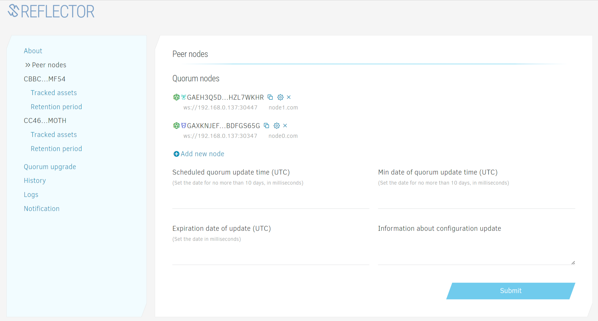
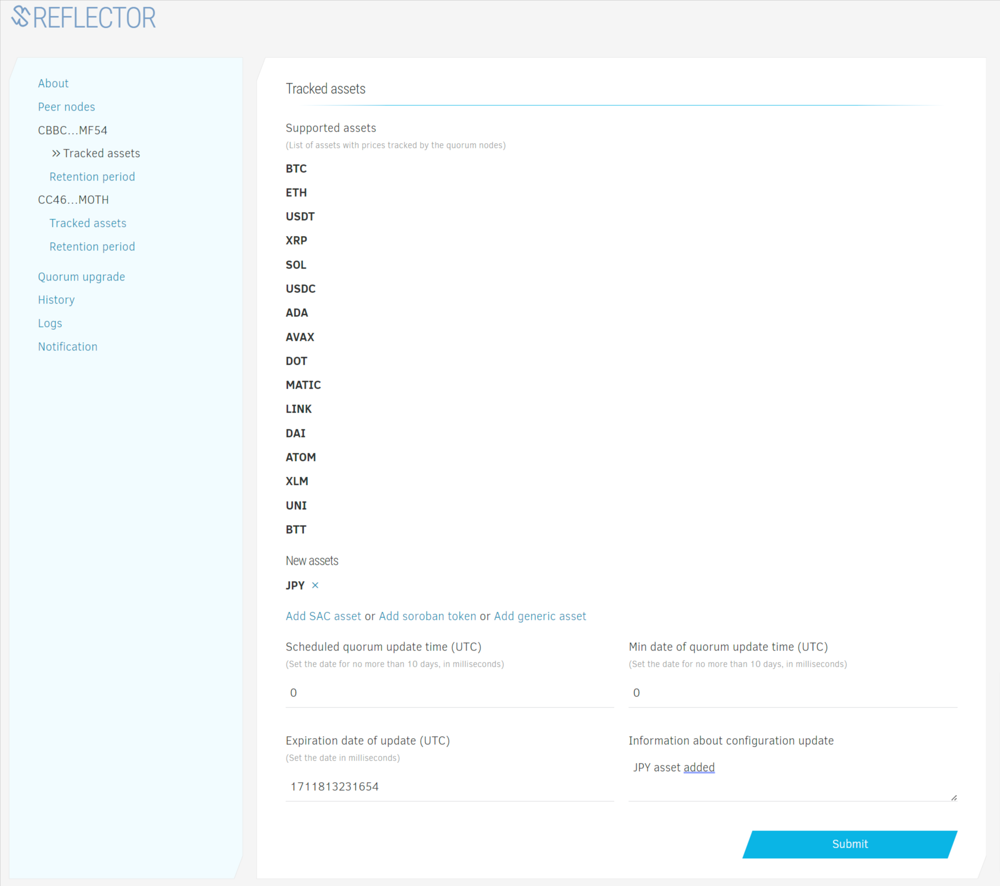

# Reflector Node Admin Guide

## Installation

1. [Install Docker](https://docs.docker.com/engine/install/).
2. Create a directory for Reflector node server. Configuration files and logs will be stored there.
3. Generate ED25519 keypair for the node (you can use [Stellar Laboratory](https://laboratory.stellar.org/#account-creator?network=public) or any other keypair generator).
4. Put the `app.config.json` file in the directory. 
```json
{
  "secret": "SA5G...1DKG", //secret key of the node
  "dataSources": { //data sources for price data
<<<<<<< HEAD
=======
    "exchanges": {
      "type": "api",
      "name": "exchanges"
    },
>>>>>>> subscription
    "pubnet": {
      "dbConnection": "postgres://stellar:@{server_ip_address}:{server_port}/stellar-core",
      "sorobanRpc": ["https://soroban-testnet.stellar.org"],
      "type": "db",
      "name": "testnet"
    },
    "exchanges": {
      "name": "exchanges",
      "type": "api"
    }
  },
  "dbSyncDelay": 15, //delay in seconds for database synchronization. Optional, default is 15
  "port": 30447 //default port for inbound connections
}
```
5. If you plan to run a new instance of Stellar Core sever, create a home directory for StellarCore database and server files. And start Stellar Core Docker image. 
  For operators running Stellar Core validators on the public network it recommended to connect to a validator node instead of starting an additional Docker image.
```bash
docker run -it -d -e POSTGRES_PASSWORD=123456 -p 5432:5432 -v "STELLAR_WORKDIR:/opt/stellar" --name stellar stellar/quickstart:soroban-dev --testnet
```
6. Start Reflector Docker image. By default it listens 30347 port.
```bash
docker run -d -p 30347:30347 -v "/opt/reflector-node-home:/reflector-node/app/home" --name=reflector reflectornet/reflector-node:latest
```
7. Open corresponding port in firewall (30347 by default).

If you run new instance of Stellar Core, it can take some time to sync Stellar database.

## Joining Reflector nodes cluster

1. Navigate to [Reflector Node admin dashboard](https://node-admin.reflector.network) in a browser 
2. Authorize via [Albedo](https://albedo.link). Click the Authorize button, and follow instructions. 
   Please make sure to use the same keypair you generated during the installation. 
3. After the authorization you need to sign the config to sync it with the quorum. 
     
4. Your node should be up and running now.

## Updating cluster settings

### Adding new node

> When a new node joins the cluster, every other Reflector node need to confirm this action.

1. Navigate to the "Peer Nodes" section.
     
2. Click "Add new node" and set new node public key, websocket connection URL (provided by the node operator) and the node operator domain.
     
3. Schedule the update by setting the timestamp.
   
4. Confirm the action. Notify other quorum node operators about the update and ask them to confirm it.
5. After the update concludes, the new node will be added to the quorum set.

### Adding new asset

1. Navigate to the "Tracked assets" section.
     
2. Choose "Add SAC asset" for adding a Stellar Classic asset, "Add generic asset" for adding any external symbol, or "Add soroban token" for adding a smart contract-based token.
   
3. Set asset **code** and **issuer** for SAC asset.  
     
4. Schedule the update by setting the timestamp.
5. Confirm the action. Notify other cluster node operators about the update and ask them to confirm it.

### Updating history retention period

1. Navigate to "Retention period" section.
2. Set history retention period in milliseconds and timestamp. That's the period during which price records will be retained on the ledger.
     
3. Schedule the update by setting the timestamp.
4. Confirm the action. Notify other cluster node operators about the update and ask them to confirm it.

**_Note:_** Minimum allowed "timestamp" is the current UTC date plus 30 minutes, maximum is current date plus 10 days.
The value will be automatically normalized to avoid concurrency conflicts with price updates.
If you want to add a new node as soon as possible, you can set the timestamp to 0. 
After the majority of nodes confirm the update, the timestamp will be set to the current time + 10 minutes.
