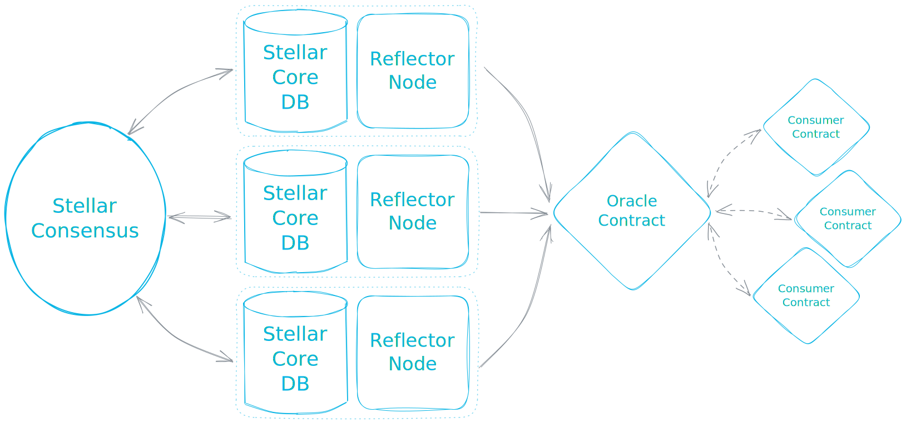

## How it works

Reflector oracle contracts are controlled by the multisig-protected consensus of reputable organizations.
The admin account of the oracle smart contract always has all node public keys as co-signers with >50% multisig threshold,
so more than half of the oracle backing nodes have to agree on a transaction in order to store price feed data or modify
oracle contract state.

Each node independently calculates the values of quoted prices using deterministic idempotent algorithms to ensure consistency
generates the update transaction, signs it with node's private key and shares it to other peer nodes via WebSocket protocol.
If for some reason (ledger access delay, failing connection, version incompatibility, adversary attack) any given nodes quotes a
token/asset price different from other nodes, the transaction hash will not match the hash generated by the majority, so the
transaction won't make it into the ledger. This way Reflector utilizes Stellar protocol underlying security to implement a
uncomplicated yet robust consensus, which guarantees reliability, fault tolerance and regular price feed updates.

For on-chain Stellar assets price feed data retrieval Reflector relies on a quorum of nodes connected to Stellar validators.
Each node fetches trades information directly from the Stellar Core database. Price feeds for generic tokens get updated in a
similar fashion, but nodes have to agree on information pulled from external sources (CEX/DEX API, price aggregators,
stock exchanges, derivative platforms, etc.)

Other contracts interact with the oracle contract, retrieving data stored by Reflector nodes.
Consumers can fetch historical ranges, use cross-price calculation, utilize TWAP averaging, or simply pull the most recent token
price depending on the use-case.
Check [examples](https://github.com/reflector-network/reflector-contract#usage-example) for practical guidance.

### Components

- **[Reflector node](https://github.com/reflector-network/reflector-node)**  
  Fetches prices, maintains p2p communication with other nodes, and publishes price updates signed by the quorum
- **[Oracle smart contract](https://github.com/reflector-network/reflector-contract)**  
  Contract implementation that incorporates consumer-facing interface with admin functionality
- **[Contract JavaScript bindings](https://github.com/reflector-network/oracle-client)**  
  Provides convenient JS wrappers for interaction with the contract from JS runtime  
- **[Stellar Core DB connector](https://github.com/reflector-network/reflector-db-connector)**  
  Database connector library responsible for retrieving and parsing data from Stellar Core
- **[Admin dashboard](https://github.com/reflector-network/admin-dashboard)**  
  Web interface for Reflector node operators, toolkit for managing Reflector cluster and orchestrating updates
- **Node API emulator**  
  Utility for testing admin dashboard with various emulated node/cluster states
- **Stellar trades emulator**  
  Simple trading bot for generating relevant trades activity on Testnet and Futurenet